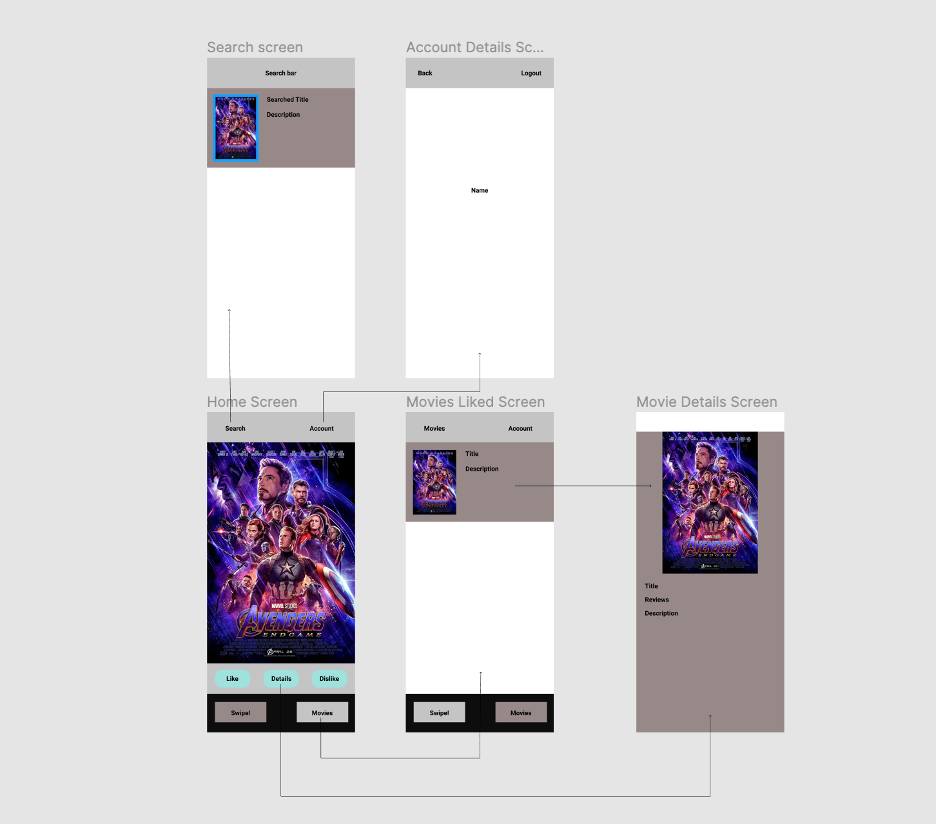

# MovieRec

## Table of Contents
1. [Overview](#Overview)
1. [Product Spec](#Product-Spec)
1. [Wireframes](#Wireframes)
2. [Schema](#Schema)

## Overview
### Description
Users can search for movies they like and find similar movies to them to watch.

### App Evaluation
- **Category:**
Entertainment
- **Mobile:**
Purely mobile experience
- **Story:**
Users will be able to like or dislike movies and search for movies to get similar movies to the ones they like.
- **Market:**
Anyone who wants to watch a movie.
- **Habit:**
Decide faster on which movie to watch.

## Product Spec

### 1. User Stories (Required and Optional)

**Required Must-have Stories**

* Login
- [ ] Display movie optons one by one
- [ ] Like or dislike movie
- [ ] Screen for movies that you have liked.
- [ ] Movie information screen
- [ ] Search page to find similar movies.
- [ ] Logout

**Optional Nice-to-have Stories**
- [ ] Add things here

### 2. Screen Archetypes

* Login screen
- [ ] User can login or register to the app
* Home screen
- [ ] Movies screen
- [ ] Home screen where all the movies are brought up
* Movies screen
- [ ] Screen where user sees all their movies liked
- [ ] Account details screen
- [ ] Screen where user can their profile logout.
  
### 3. Navigation

**Tab Navigation** (Tab to Screen)

- [ ] Main movie screen
- [ ] Movie screen
- [ ] Settings screen

**Flow Navigation** (Screen to Screen)

* Forced Log-in -> Account creation if no log in is available
* Forced Log-in -> Movie view screen
- [ ] Movie view screen -> User able to like or dislike movies
- [ ] Movie view screen -> Movie details screen
* Movie liked screen -> User able to unlike or view movies
- [ ] Movie view screen -> Account Details screen

## Wireframes

